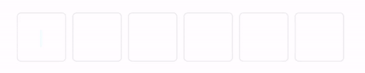

# ASPinCodeField
 
ASPinCodeField is a UI Component that allows you to integrate a pin / digit code UI within your app.

## Overview


### Appareance



###  Behind the scenes

As simple as:


## 🔶 Requirements

- iOS 9.0+
- Swift 5.0

## 👨🏻‍💻 Usage

```swift
let pinCodeView = ASPinCodeField()
pinCodeView.delegate = self
pinCodeView.dataSource = self
pinCodeView.borderColor = UIColor.lightGray
pinCodeView.textColor = UIColor.black
pinCodeView.cornerRadius = 4
pinCodeView.itemsSpacing = 8
pinCodeView.textFont = .boldSystemFont(ofSize: 20)
```

Delegate and DataSource
```swift
public protocol ASPinCodeFieldDelegate: class {
    func pinCodeField(_ pinCodeField: ASPinCodeField, didChangeText text: String)
}

public protocol ASPinCodeFieldDataSource: class {
    func numberOfDigits(in pinCodeField: ASPinCodeField) -> Int
    func canPasteFromPasteBoard(_ pinCodeField: ASPinCodeField, pasteboard: String) -> Bool
}
```

## Installation

### CocoaPods

```pod 'ASPinCodeField'```

### Carthage

```github "Aymenworks/ASPinCodeField"```


## License

ASPinCodeField is released under the MIT license.
