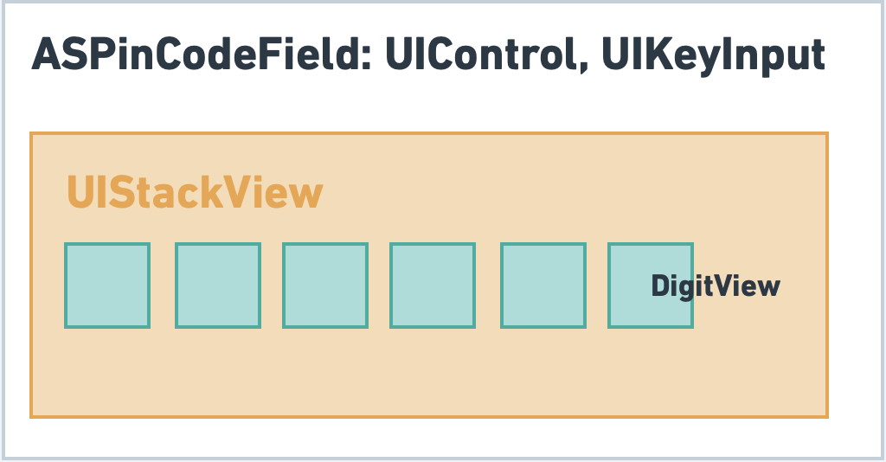

# 🔢 ASPinCodeField
 
 Another PinCode View

## Overview



## 🔶 Requirements

iOS 9.0+
Swift 5.0

## 📱 Features

- [x] Feature 1
- [ ] Feature 2

## 👨🏻‍💻 Usage

```swift
let pinCodeView = ASPinCodeField()
pinCodeView.delegate = self
pinCodeView.dataSource = self
pinCodeView.borderColor = UIColor.lightGray
pinCodeView.textColor = UIColor.black
pinCodeView.cornerRadius = 4
pinCodeView.textFont = .boldSystemFont(ofSize: 20)
```

## Installation

### CocoaPods

TODO

### Carthage

TODO

## License

ASPinCodeField is released under the MIT license.
